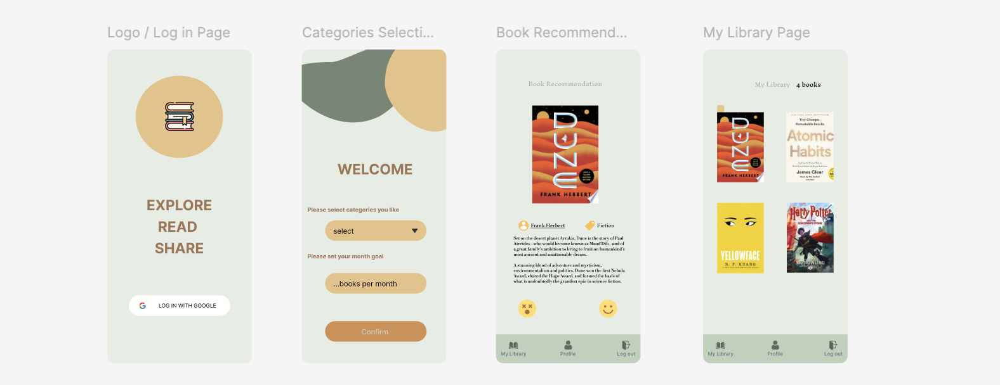

# Binder - Book Recommendation App for iOS



Binder is a Swift-based iOS app designed to help users discover and share book recommendations. Built with **Firebase** for backend services, **Google Books API** for rich book data, and secure user authentication, Binder offers a seamless experience for book lovers to explore new titles and curate their reading lists.

## Features

- **Personalized Recommendations**: Get tailored book suggestions based on your preferences and reading history.
- **Search & Discover**: Browse millions of titles using the Google Books API.
- **User Authentication**: Secure sign-up/login via Firebase Authentication.
- **Save Favorites**: Bookmark books to your profile with Firebase Firestore.
- **Clean Interface**: Intuitive and user-friendly iOS-native UI.

## Technologies Used

- **Swift**: Primary language for iOS development.
- **Firebase**: 
  - **Authentication**: User sign-up/login.
  - **Firestore**: Store user data and favorites.
- **Google Books API**: Fetch book details, covers, and summaries.
- **CocoaPods**: Dependency management for Firebase SDKs.

## Installation

1. **Prerequisites**: 
   - Xcode 13+
   - CocoaPods (`sudo gem install cocoapods`)
2. Clone the repository:
   ```bash
   git clone https://github.com/yourusername/Binder.git
   cd Binder
   ```
3. Install dependencies:
   ```bash
   pod install
   ```
4. Open `Binder.xcworkspace` in Xcode and build the project.

## Configuration

1. **Firebase Setup**:
   - Create a Firebase project at [console.firebase.google.com](https://console.firebase.google.com/).
   - Add the `GoogleService-Info.plist` file to your Xcode project.
   - Enable **Email/Password Authentication** and **Firestore Database** in Firebase Console.
2. **Google Books API**:
   - Obtain an API key from the [Google Cloud Console](https://console.cloud.google.com/).
   - Add the key to `Constants.swift` or a dedicated configuration file:
     ```swift
     let GOOGLE_BOOKS_API_KEY = "YOUR_API_KEY"
     ```
---
